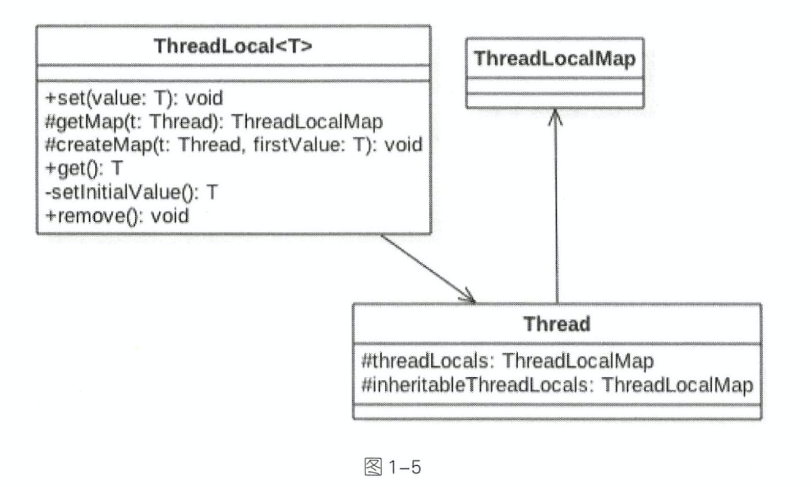

# java多线程

## java线程基础

### 基本概念

#### 进程和线程

##### 简介

进程就是应用程序在内存中分配的空间，也就是正在运行的程序，各个进程之间互不干扰。同时进程保存着程序每一个时刻运行的状态。

线程与进程相似，但线程是一个比进程更小的执行单位。一个进程在其执行的过程中可以产生多个线程。与进程不同的是同类的多个线程共享同一块内存空间和一组系统资源，所以系统在产生一个线程，或是在各个线程之间作切换工作时，负担要比进程小得多，也正因为如此，线程也被称为轻量级进程。

##### 进程和线程的区别

* 进程是一个独立的运行环境，而线程是在进程中执行的一个任务。他们两个本质的区别是是否单独占有内存地址空间及其它系统资源（比如I/O）：
  * 进程单独占有一定的内存地址空间，所以进程间存在内存隔离，数据是分开的，数据共享复杂但是同步简单，各个进程之间互不干扰；而线程共享所属进程占有的内存地址空间和资源，数据共享简单，但是同步复杂。
  * 进程单独占有一定的内存地址空间，一个进程出现问题不会影响其他进程，不影响主程序的稳定性，可靠性高；一个线程崩溃可能影响整个程序的稳定性，可靠性较低。
  * 进程单独占有一定的内存地址空间，进程的创建和销毁不仅需要保存寄存器和栈信息，还需要资源的分配回收以及页调度，开销较大；线程只需要保存寄存器和栈信息，开销较小。
* 进程是操作系统进行资源分配的基本单位，而线程是操作系统进行调度的基本单位，即CPU分配时间的单位。

#### 线程状态

Java 线程在运行的生命周期中的指定时刻只可能处于下面 6 种不同状态的其中一个状态（图源《Java 并发编程艺术》4.1.4 节）。


线程在生命周期中并不是固定处于某一个状态而是随着代码的执行在不同状态之间切换。Java 线程状态变迁如下图所示（图源《Java 并发编程艺术》4.1.4 节）：


#### 上下文切换

上下文切换（有时也称做进程切换或任务切换）是指 CPU 从一个进程（或线程）切换到另一个进程（或线程）。上下文是指某一时间点 CPU 寄存器和程序计数器的内容。

> 举例说明 线程A - B  <br/>
1.先挂起线程A，将其在cpu中的状态保存在内存中。<br/>
2.在内存中检索下一个线程B的上下文并将其在 CPU 的寄存器中恢复,执行B线程。<br/>
3.当B执行完，根据程序计数器中指向的位置恢复线程A。<br/>

上下文切换通常是计算密集型的，意味着此操作会消耗大量的 CPU 时间，故线程也不是越多越好。

### 创建线程

#### 创建线程的方法

#### 本质

### 线程同步

### 线程调度

### 线程间通信

### 其他

#### ThreedLocal相关

ThreedLocal是JDK提供的线程本地变量的实现方案。

首先看下类图，ThreedLocal内部维护一个静态内部类ThreedLocalMap实现，成员Entry是一个k-v对，key为ThreedLocal对象自身，value是我们在存入的线程本地变量。这个ThreedLocalMap维护在Thread中的threadLocals和inheritableTreadLocals中（可继承的ThreadLocal,用于满足访问父线程本地变量的需求）。



从下面get方法中我们可以看出，在调用方法时获取的时当前线程的成员ThreedLocalMap中对应的值。
```
   public T get() {
        Thread t = Thread.currentThread();
        ThreadLocalMap map = getMap(t);
        if (map != null) {
            ThreadLocalMap.Entry e = map.getEntry(this);
            if (e != null) {
                @SuppressWarnings("unchecked")
                T result = (T)e.value;
                return result;
            }
        }
        return setInitialValue();
    }
```
set同理
```
    public void set(T value) {
        Thread t = Thread.currentThread();
        ThreadLocalMap map = getMap(t);
        if (map != null)
            map.set(this, value);
        else
            createMap(t, value);
    }
    
    void createMap(Thread t, T firstValue) {
        t.threadLocals = new ThreadLocalMap(this, firstValue);
    }
```
关于InheritableThreadLocal, 它继承至ThreadLocal, 提供了新特性, 可以访问父线程的本地变量。
```
    protected T childValue(T parentValue) {
        return parentValue;
    }

    ThreadLocalMap getMap(Thread t) {
       return t.inheritableThreadLocals;
    }

    void createMap(Thread t, T firstValue) {
        t.inheritableThreadLocals = new ThreadLocalMap(this, firstValue);
    }
```
在ThreadLocalMap的构造器中存在这样一个重载方法，通过父线程的本地变量构造本地变量。
```
        private ThreadLocalMap(ThreadLocalMap parentMap) {
            Entry[] parentTable = parentMap.table;
            int len = parentTable.length;
            setThreshold(len);
            table = new Entry[len];

            for (int j = 0; j < len; j++) {
                Entry e = parentTable[j];
                if (e != null) {
                    @SuppressWarnings("unchecked")
                    ThreadLocal<Object> key = (ThreadLocal<Object>) e.get();
                    if (key != null) {
                        Object value = key.childValue(e.value);
                        Entry c = new Entry(key, value);
                        int h = key.threadLocalHashCode & (len - 1);
                        while (table[h] != null)
                            h = nextIndex(h, len);
                        table[h] = c;
                        size++;
                    }
                }
            }
        }
```

### 池化

## 线程进阶

### happens-before与重排序
SR-133使用happens-before的概念来阐述操作之间的内存可见性。在JMM中，不限于同一个线程，如果一个操作执行的结果需要对另一个操作可见，那么这两个操作之间必须要存在happens-before关系。
与程序员密切相关的happens-before规则，即jmm呈现给开发者的视图如下：

* 程序顺序规则：一个线程中的每个操作，happens-before于该线程中的任意后续操作。
* 监视器锁规则：对一个锁的解锁，happens-before于随后对这个锁的加锁。
* volatile变量规则：对一个volatile域的写，happens-before于任意后续对这个volatile域的读。
* 传递性：如果A happens-before B，且B happens-before C，那么A happens-before C。

一个happens-before规则对应于一个或多个编译器和处理器重排序规则。对于Java程序员来说，happens-before规则简单易懂，它避免Java程序员为了理解JMM提供的内存可见性保证而去学习复杂的重排序规则以及这些规则的具体实现方法。
重排序是指编译器和处理器为了优化程序性能而对指令序列进行重新排序的一种手段。但编译器和处理器在重排序时，会遵守数据依赖性，编译器和处理器不会改变存在数据依赖关系的两个操作的执行顺序。数据依赖性包括写后读，读后写，写后写，顺序一旦改变，结果也会不同。这里所说的数据依赖性仅针对单个处理器中执行的指令序列和单个线程中执行的操作，不同处理器之间和不同线程之间的数据依赖性不被编译器和处理器考虑。

### CAS

#### 乐观锁与悲观锁

锁可以从不同的角度分类。其中，乐观锁和悲观锁是一种分类方式。
悲观锁：
悲观锁就是我们常说的锁。对于悲观锁来说，它总是认为每次访问共享资源时会发生冲突，所以必须对每次数据操作加上锁，以保证临界区的程序同一时间只能有一个线程在执行。

乐观锁：
乐观锁又称为“无锁”，顾名思义，它是乐观派。乐观锁总是假设对共享资源的访问没有冲突，线程可以不停地执行，无需加锁也无需等待。而一旦多个线程发生冲突，乐观锁通常是使用一种称为CAS的技术来保证线程执行的安全性。

由于无锁操作中没有锁的存在，因此不可能出现死锁的情况，也就是说乐观锁天生免疫死锁。

乐观锁多用于“读多写少“的环境，避免频繁加锁影响性能；而悲观锁多用于”写多读少“的环境，避免频繁失败和重试影响性能。

#### CAS原理

CAS的全称是：比较并交换（Compare And Swap）。
Unsafe中对CAS的实现是C++写的，它的具体实现和操作系统、CPU都有关系。
主要过程为：判断V是否等于E，如果等于，将V的值设置为N；如果不等，说明已经有其它线程更新了V，则当前线程放弃更新，什么都不做。


所以这里的预期值E本质上指的是“旧值”。

Linux的X86下主要是通过cmpxchgl这个指令在CPU级完成CAS操作的，但在多处理器情况下必须使用lock指令加锁来完成。当然不同的操作系统和处理器的实现会有所不同，大家可以自行了解。

当然，Unsafe类里面还有其它方法用于不同的用途。比如支持线程挂起和恢复的park和unpark， LockSupport类底层就是调用了这两个方法。还有支持反射操作的allocateInstance()方法。

#### ABA问题

所谓ABA问题，就是一个值原来是A，变成了B，又变回了A。这个时候使用CAS是检查不出变化的，但实际上却被更新了两次。

ABA问题的解决思路是在变量前面追加上版本号或者时间戳。从JDK 1.5开始，JDK的atomic包里提供了一个类AtomicStampedReference类来解决ABA问题。

### 锁

#### 锁分类

#### 锁升级

#### 锁膨胀

#### 死锁

### 内置线程框架

### AQS

AQS是AbstractQueuedSynchronizer的简称，即抽象队列同步器，从字面意思上理解:
抽象：抽象类，只实现一些主要逻辑，有些方法由子类实现；
队列：使用先进先出（FIFO）队列存储数据；
同步：实现了同步的功能。

AQS是一个用来构建锁和同步器的框架，使用AQS能简单且高效地构造出应用广泛的同步器，比如我们提到的ReentrantLock，Semaphore，ReentrantReadWriteLock，SynchronousQueue，FutureTask等等皆是基于AQS的。

AQS内部使用了一个volatile的变量state来作为资源的标识。同时定义了几个获取和改版state的protected方法，子类可以覆盖这些方法来实现自己的逻辑：

```java
getState()
setState()
compareAndSetState()
```

其中compareAndSetState的实现依赖于Unsafe的compareAndSwapInt()方法。

### 并发容器

## 参考资料及推荐阅读

<https://snailclimb.gitee.io/javaguide/#/docs/java/Java%E5%9F%BA%E7%A1%80%E7%9F%A5%E8%AF%86>

[《深入浅出java多线程》](<http://concurrent.redspider.group/article/01/1.html>)(推荐）

[死磕Synchronized底层实现--概论
](<https://github.com/farmerjohngit/myblog/issues/12>)

[linux内核级同步机制--futex](<https://github.com/farmerjohngit/myblog/issues/8>)

## 纸质书单

《java并发编程实战》
《java并发编程之美》
《java并发编程的艺术》

