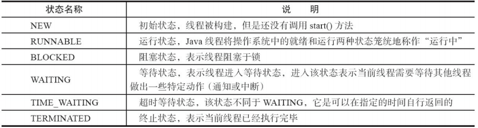

# java多线程

## java线程基础

### 基本概念

#### 进程和线程

##### 简介

进程就是应用程序在内存中分配的空间，也就是正在运行的程序，各个进程之间互不干扰。同时进程保存着程序每一个时刻运行的状态。

线程与进程相似，但线程是一个比进程更小的执行单位。一个进程在其执行的过程中可以产生多个线程。与进程不同的是同类的多个线程共享同一块内存空间和一组系统资源，所以系统在产生一个线程，或是在各个线程之间作切换工作时，负担要比进程小得多，也正因为如此，线程也被称为轻量级进程。

##### 进程和线程的区别

* 进程是一个独立的运行环境，而线程是在进程中执行的一个任务。他们两个本质的区别是是否单独占有内存地址空间及其它系统资源（比如I/O）：
  * 进程单独占有一定的内存地址空间，所以进程间存在内存隔离，数据是分开的，数据共享复杂但是同步简单，各个进程之间互不干扰；而线程共享所属进程占有的内存地址空间和资源，数据共享简单，但是同步复杂。
  * 进程单独占有一定的内存地址空间，一个进程出现问题不会影响其他进程，不影响主程序的稳定性，可靠性高；一个线程崩溃可能影响整个程序的稳定性，可靠性较低。
  * 进程单独占有一定的内存地址空间，进程的创建和销毁不仅需要保存寄存器和栈信息，还需要资源的分配回收以及页调度，开销较大；线程只需要保存寄存器和栈信息，开销较小。
* 进程是操作系统进行资源分配的基本单位，而线程是操作系统进行调度的基本单位，即CPU分配时间的单位。

#### 线程状态

Java 线程在运行的生命周期中的指定时刻只可能处于下面 6 种不同状态的其中一个状态（图源《Java 并发编程艺术》4.1.4 节）。


线程在生命周期中并不是固定处于某一个状态而是随着代码的执行在不同状态之间切换。Java 线程状态变迁如下图所示（图源《Java 并发编程艺术》4.1.4 节）：


#### 上下文切换

上下文切换（有时也称做进程切换或任务切换）是指 CPU 从一个进程（或线程）切换到另一个进程（或线程）。上下文是指某一时间点 CPU 寄存器和程序计数器的内容。

> 举例说明 线程A - B  <br/>
1.先挂起线程A，将其在cpu中的状态保存在内存中。<br/>
2.在内存中检索下一个线程B的上下文并将其在 CPU 的寄存器中恢复,执行B线程。<br/>
3.当B执行完，根据程序计数器中指向的位置恢复线程A。<br/>

上下文切换通常是计算密集型的，意味着此操作会消耗大量的 CPU 时间，故线程也不是越多越好。

### 创建线程

#### 创建线程的方法

#### 本质

### 线程同步

### 线程调度

### 线程间通信

### 池化

## 线程进阶

### 锁

#### 锁分类

#### 锁升级

#### 锁膨胀

#### 死锁

### 内置线程框架

### AQS

AQS是AbstractQueuedSynchronizer的简称，即抽象队列同步器，从字面意思上理解:
抽象：抽象类，只实现一些主要逻辑，有些方法由子类实现；
队列：使用先进先出（FIFO）队列存储数据；
同步：实现了同步的功能。

AQS是一个用来构建锁和同步器的框架，使用AQS能简单且高效地构造出应用广泛的同步器，比如我们提到的ReentrantLock，Semaphore，ReentrantReadWriteLock，SynchronousQueue，FutureTask等等皆是基于AQS的。

AQS内部使用了一个volatile的变量state来作为资源的标识。同时定义了几个获取和改版state的protected方法，子类可以覆盖这些方法来实现自己的逻辑：

```java
getState()
setState()
compareAndSetState()
```

其中compareAndSetState的实现依赖于Unsafe的compareAndSwapInt()方法。

### 并发容器

## 参考资料及推荐阅读

<https://snailclimb.gitee.io/javaguide/#/docs/java/Java%E5%9F%BA%E7%A1%80%E7%9F%A5%E8%AF%86>

[《深入浅出java多线程》](<http://concurrent.redspider.group/article/01/1.html>)(推荐）

[死磕Synchronized底层实现--概论
](<https://github.com/farmerjohngit/myblog/issues/12>)

[linux内核级同步机制--futex](<https://github.com/farmerjohngit/myblog/issues/8>)

## 纸质书单


